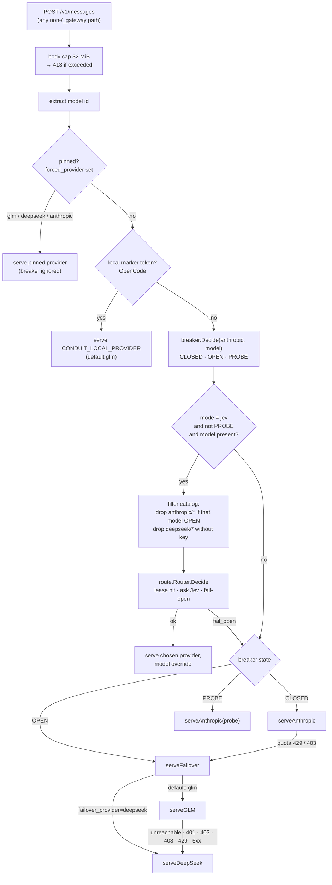
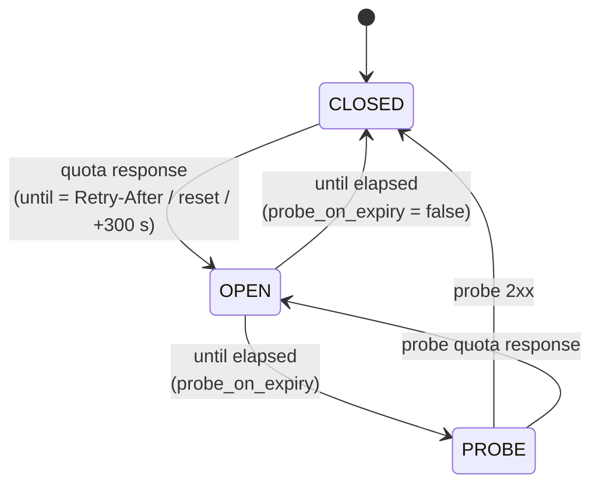

# conduit — architecture

conduit is a loopback HTTP gateway that sits between an agent (Claude Code,
OpenCode) and the Anthropic Messages API. Every request the agent makes goes
through it. The gateway decides *which* upstream answers — Anthropic on the
Claude subscription, GLM via Z.ai, or DeepSeek — and forwards the request
otherwise untouched. Three routing modes exist; the default one only leaves
Anthropic when the plan quota is observably exhausted.

This document explains how a request moves through the process, what each
package is responsible for, what lives on disk, and how the repository is laid
out. The [README](README.md) is the operator's guide; this is the map.

---

## 1. The one-paragraph model

```
agent ──ANTHROPIC_BASE_URL──▶ conduit (127.0.0.1:8787) ──▶ anthropic | glm | deepseek
```

The agent is told its API lives at `http://127.0.0.1:8787`. It keeps its own
credential (Claude OAuth), which conduit forwards as-is to Anthropic. On the
GLM and DeepSeek paths conduit swaps in the provider's key and rewrites the
`model` field — nothing else in the body changes. Streaming responses are
copied through as they arrive; conduit never buffers a successful stream and
never splices providers mid-stream.

---

## 2. Request path

Every proxied request runs through `internal/proxy.(*Gateway).handleProxy`.
The order below is the order in the code, and it matters: earlier branches win.



### 2.1 Pinned

`forced_provider` / `forced_model` (set via the UI, `conduitctl route pin`, or
`POST /_gateway/route`) short-circuit everything. Pinning `anthropic` also
suppresses quota failover — the user chose to see the raw 429s.

### 2.2 Local marker token

Clients without an Anthropic credential (OpenCode) authenticate to the gateway
with a marker string (`conduit-local` by default). They can never reach
Anthropic, so they are routed straight to `CONDUIT_LOCAL_PROVIDER`.

### 2.3 Breaker decision

`breaker.Decide` looks up the `(anthropic, model)` entry:

- **CLOSED** (no entry) — Anthropic.
- **OPEN** — the plan is exhausted for this model until `until`; go to the
  failover tier (`failover_provider`, `glm` by default, `deepseek` opt-in).
- **PROBE** — the open window expired; send *this one* request to Anthropic to
  find out. Success closes the entry, a fresh quota error re-opens it.

`Decide` is the request-path accessor and may transition OPEN→PROBE (and
persist). Candidate filtering in jev mode uses the read-only `breaker.State`
so that looking at a model's state never changes it.

### 2.4 Jev gate

Only real model calls qualify: `mode == jev`, the router has a key, the body
carries a `model`, the method is POST, and the requested model is not due a
probe. A due probe bypasses Jev so the half-open entry can resolve — the same
thing auto mode would do.

Candidates are the configured catalog minus `anthropic/*` entries whose
breaker is OPEN and minus `deepseek/*` when no key is set. The router then
either reuses a lease, asks Jev, or fails open (§4). A successful decision is
served on the chosen provider with `model` rewritten to the pick — including
on the Anthropic path when Jev chose a different Claude model. The response
carries `X-Conduit-Decision: jev|lease|fail_open`.

### 2.5 The provider functions

**`serveAnthropic`** forwards the body byte-identical (prompt-cache safe) with
the inbound credential. Up to `1 + max_transient_retries` attempts; transient
errors (5xx, 529, "not your usage limit" throttles) back off with jitter. A
response classified as **Quota** opens the breaker for the model that was
*actually sent* (which may be Jev's pick, not the requested id), then — if
nothing has been written to the client yet — replays the request on the
failover tier (`serveFailover` → `serveGLM` by default, `serveDeepSeek` when
`failover_provider = "deepseek"`). Auth
and client errors are surfaced untouched. On a 2xx, `ProactiveQuota` applies
the opt-in `-remaining` / `-utilization` thresholds; it deliberately ignores
the `unified-status` header on successful responses (see FINDINGS.md).

**`serveGLM`** maps the Claude model id through `[glm.model_map]` /
`default_model` (or takes the pinned / Jev override), strips
`Anthropic-Beta`, injects `ZAI_API_KEY`. Unreachable, 401/403/408/429 or 5xx
hand the request to DeepSeek if that tier is configured; otherwise the GLM
error is surfaced.

**`serveDeepSeek`** serves the DeepSeek tier — the terminal fallback behind a
failed GLM, or the primary failover when `failover_provider = "deepseek"`. It
rewrites the model and drops the
`Artifact` tool (DeepSeek's validator rejects its schema; if that was the only
tool, the `tools` key is omitted). This is the one place the tool list is not
forwarded verbatim, and it applies in every mode.

**`writeUpstream`** streams the response to the client with `X-Conduit-Provider`
set. On the *first* reply after a failover it injects a chat notice
(`[conduit] Switched to GLM …`) into the first assistant text — for SSE via
`announce.NewSSEInjector`, for JSON via `announce.InjectJSON` — and sets
`X-Conduit-Notice`.

---

## 3. Classifying an Anthropic error

`internal/classify` turns `(status, headers, body)` into one of
`OK · Quota · Transient · Auth · ClientError · Other`. The rule that keeps the
gateway from failing over on ordinary load is:

| signal | class |
|---|---|
| 429 **with** `anthropic-ratelimit-unified-*` headers | Quota — open breaker |
| 429 whose message says "not your usage limit" / "temporarily limiting", or without unified headers | Transient — retry Anthropic, never fail over |
| 429 `rate_limit_error` **without** unified headers, with `treat_headerless_429_as_quota = true` | Quota — open breaker (opt-in) |
| 403 `billing_error` or a billing/credit message | Quota |
| 401, 403 `permission_error` | Auth — surface |
| 400 | ClientError — surface |
| 500 · 502 · 503 · 529 | Transient |

`until` is derived from `Retry-After`, then the unified `*-reset` headers, then
any `*-reset` header, else the breaker's `fallback_open_seconds` (300).

---

## 4. Jev routing (`internal/route`)

Jev is TypeSafe's System One model. conduit asks it two typed questions per
call and applies the answers; it is a classifier for *which model*, not an LLM
that touches the conversation.

```mermaid
sequenceDiagram
    participant P as proxy
    participant R as route.Router
    participant D as dossier
    participant J as api.typesafe.ai/v1/systemone
    P->>R: Decide(ctx, body, candidates)
    R->>D: Extract(body)
    D-->>R: bounded Dossier + fingerprint + tool set
    R->>R: lease lookup (fingerprint)
    alt lease valid
        R-->>P: Decision{source: lease}
    else ask
        R->>J: {model: jev-latest, state: dossier, questions: {model, lease}}
        J-->>R: {answers: {model: {choice, confidence}, lease: {choice}}}
        R->>R: validate choice ∈ candidates; store lease
        R-->>P: Decision{source: jev}
    end
    Note over R: any error, timeout (4 s), invalid answer → Decision{source: fail_open}, ok=false
    R->>R: append to ring (200) + decisions.jsonl
```

### 4.1 The dossier

`dossier.go` projects the inbound body into a small document. It is the
*only* thing that leaves the machine to TypeSafe. Everything derived from
client input is clipped, rune-safe, before it goes anywhere:

| field | source | cap |
|---|---|---|
| `task` | last user message text | 1200 chars, head + tail |
| `step` | `user_turn` · `tool_step` · `other` | — |
| `tool`, `tool_batch` | tool_use names matched by `tool_use_id`; result count, error count, excerpts (errors first) | 16 names × 64 chars; 3 excerpts × 120 chars |
| `intent_tail` | last assistant text (tool steps only) | 400 chars |
| `requested_model` | `model` | 128 chars |
| `thinking_budget`, `n_messages`, `n_tools`, `has_image` | body | — |

The system prompt and tool schemas are never included.

### 4.2 The questions

- **`model`** — a `choice` over the catalog keys (`provider/model`), each with
  its profile text as the criterion. The instructions are capability-first:
  use the strongest model that will do the work, step down only for genuinely
  mechanical steps, never on price alone. The ladder is spelled out per
  provider because the criteria map is unordered.
- **`lease`** — `one_call` · `tool_chain` · `user_turn`: how long the pick may
  be reused without asking again.

### 4.3 Leases

A conversation is identified by a fingerprint: SHA-256 of the first system
text block plus the first user message (clipped to 2000 chars). Per
fingerprint the router keeps the last decision and its lease:

| lease | reused while |
|---|---|
| `one_call` | never |
| `tool_chain` | the step is a tool step **and** the tool set matches the leased one |
| `user_turn` | every tool step, until the user speaks again |

Leases expire after `lease_ttl_seconds` (600), are dropped if the leased
candidate is no longer in the filtered list, and the map is capped at 1000
entries. A reused decision is recorded with `source: lease`.

### 4.4 Fail-open

`Decide` never blocks past the timeout, never panics (a `recover` converts a
panic into a fail-open), and never surfaces an error to the client. Any
failure yields `ok=false`; the proxy then serves the request exactly as
`auto` would. The reason (redacted) is recorded.

### 4.5 Records

Every decision — including fail-open — goes to an in-memory ring (200, shown as
`jev.recent` in the UI) and is appended to `decisions.jsonl` (mode 0600,
rotated at 4 MiB to `decisions.jsonl.1`). Fields are the already-clipped
dossier values plus provider, model, lease, source, confidence, latency.

---

## 5. The breaker (`internal/breaker`)



Entries are keyed `upstream|model`, so one exhausted model does not take the
others down. The same struct also holds the routing **mode**
(`auto|pinned|jev`), the **forced** provider/model, and the last quota event;
all of it is persisted atomically (temp file + rename, 0600) to `state.json`
on every change and reloaded at startup. Invariants: pinning a provider sets
mode `pinned`; clearing it sets `auto`; `SetMode(jev|auto)` clears any pin.

---

## 6. Configuration (`internal/config`)

`config.Load` builds the effective config in this order — later wins:

1. built-in defaults (`config.Default`, including the default Jev catalog);
2. `~/.config/conduit/config.toml` (or `CLAUDE_GLM_GATEWAY_CONFIG`);
3. `.env` next to the config file, loaded into the process environment
   **without** overriding variables that are already exported;
4. `CLAUDE_GLM_GATEWAY_*` and `CONDUIT_JEV_TIMEOUT_MS` environment overrides;
5. key resolution: `ZAI_API_KEY` (required), `DEEPSEEK_API_KEY` and
   `TYPESAFE_API_KEY` (optional — their tiers are inert when absent);
6. local-token settings, path expansion, and the loopback-only check on
   `listen`.

Unknown TOML keys are currently ignored rather than rejected
(tracked in issue #14).

The **Jev catalog** is `[[jev.catalog]]`; defining any entry replaces the
whole default list. Each entry is `provider`, `model`, `profile` — the profile
is the text Jev reads, so it is the tuning lever.

---

## 7. Side channels

| package | job |
|---|---|
| `internal/metrics` | request counters per provider, failovers, transient retries, Jev decisions / fail-opens; shape of `/_gateway/status` |
| `internal/notify` | failover notices: desktop toast (macOS Notification Center / `notify-send`; DeepSeek toasts throttled to one per 5 min), `route.json` for status lines, and the chat-notice toggle |
| `internal/announce` | injects the one-shot chat notice into the first assistant text, for JSON and SSE bodies |
| `internal/capture` | appends non-2xx upstream responses to `upstream-errors.jsonl` for later classification work |
| `internal/redact` | strips credentials (header names, `Bearer …` tokens) from anything that is logged or persisted |

---

## 8. HTTP surface

| endpoint | purpose |
|---|---|
| `GET /_gateway/health` | `{"ok":true}` |
| `GET /_gateway/status` | mode, routing, breaker snapshot, counters, upstream URLs, last request |
| `GET /_gateway/route` | mode, pin, available models, Jev catalog + recent decisions |
| `POST /_gateway/route` | `{"clear":true}` · `{"provider","model"}` · `{"mode":"auto\|pinned\|jev"}` — requires `application/json` or form content type and refuses a foreign `Origin` |
| `GET /_gateway/ui` | the control page (single self-contained HTML, polls every 2 s) |
| anything else | proxied per §2 |

Response headers on proxied calls: `X-Conduit-Provider` always;
`X-Conduit-Notice` on the failover reply; `X-Conduit-Decision` in jev mode.

---

## 9. Processes and files

Two binaries are built from this module:

| binary | source | installed as | role |
|---|---|---|---|
| gateway | `cmd/gateway` | `~/.local/bin/conduit` | the daemon; runs under launchd on macOS (`contrib/macos/com.pedro.conduit.plist`, KeepAlive) or `nohup` elsewhere |
| CLI | `cmd/conduit` | `~/.local/bin/conduitctl` | loopback client for the endpoints above (`route`, `status`, `decisions`, `ui`) |

State on disk:

| path | contents |
|---|---|
| `~/.config/conduit/config.toml` | operator config (copied from `config.example.toml` on first setup) |
| `~/.config/conduit/.env` | `ZAI_API_KEY`, optional `DEEPSEEK_API_KEY`, `TYPESAFE_API_KEY` — 0600, never in the repo |
| `~/.local/state/conduit/state.json` | breaker entries, mode, pin, last quota event |
| `~/.local/state/conduit/decisions.jsonl` (+ `.1`) | Jev decision log |
| `~/.local/state/conduit/upstream-errors.jsonl` | captured non-2xx upstream responses |
| `~/.local/state/conduit/route.json` | current provider/model for status-line integrations |
| `~/.local/state/conduit/gateway.log` | structured JSON log, one `request` line per proxied call |
| `~/.claude/settings.json` | `ANTHROPIC_BASE_URL` pointed at the gateway by `setup.sh` |
| `~/.config/opencode/opencode.json` | provider entry with the marker token (only with `CONDUIT_WIRE_OPENCODE=1`) |

---

## 10. Security model

- **Loopback only.** `listen` must be `127.0.0.1`/`localhost` (config check),
  and the process refuses a non-loopback bind even if that check were
  bypassed. There is no gateway authentication beyond that.
- **Credentials stay on their path.** The inbound Claude credential is
  forwarded only to Anthropic; `ZAI_API_KEY` / `DEEPSEEK_API_KEY` are
  injected only on their provider's request; `TYPESAFE_API_KEY` goes only to
  `api.typesafe.ai`. None of them appear in logs, the decision log or the UI
  (`internal/redact` guards every persisted string).
- **Bounded input.** 32 MiB body cap before parsing; every client-derived
  string in the Jev dossier and decision record is clipped.
- **State changes need intent.** `POST /_gateway/route` rejects foreign
  `Origin` headers and non-JSON/form content types, so a web page cannot flip
  routing.
- **Untrusted answers.** A Jev answer selects only among locally configured
  catalog entries; anything else is a fail-open, never a routing target.

---

## 11. Repository layout

```
.
├── cmd/
│   ├── gateway/        the daemon (main.go wires config → breaker → capture → metrics → route → proxy)
│   └── conduit/        conduitctl: route.go, status.go, decisions.go, ui.go, client.go, cli_test.go
├── internal/
│   ├── proxy/          handleProxy + provider functions, HTTP API, ui.go (embedded control page)
│   ├── route/          Jev: mode.go, dossier.go, client.go, router.go (+ tests)
│   ├── breaker/        per-(upstream, model) circuit breaker + persisted mode/pin
│   ├── classify/       Anthropic error → Quota / Transient / Auth / … ; proactive thresholds
│   ├── config/         TOML + .env + env loading, model maps, default Jev catalog
│   ├── metrics/        counters and the /_gateway/status shape
│   ├── notify/         desktop toasts, route.json, notice toggles
│   ├── announce/       chat-notice injection (JSON + SSE)
│   ├── capture/        upstream-errors.jsonl writer
│   └── redact/         credential scrubbing
├── scripts/
│   ├── lib.sh          shared shell: key prompts, .env upsert, launchd/nohup lifecycle, Claude/OpenCode settings patching
│   ├── install-launchagent.sh
│   └── conduit-run     legacy wrapper (prefer setup.sh)
├── contrib/macos/      launchd plist template (@HOME@ substituted at install)
├── docs/               logo, UI screenshot
├── setup.sh · start.sh · stop.sh · status.sh · uninstall.sh
├── config.example.toml · .env.example
├── Makefile            build (gateway) · conduitctl · test · setup/start/stop/status/uninstall
├── README.md           operator guide
├── ARCHITECTURE.md     this file
└── FINDINGS.md         wire-level findings about the upstreams (quota headers, GLM quirks, …)
```

Dependency direction inside `internal/`: `proxy → {breaker, route, classify, config, metrics, notify, announce, capture, redact}`, `breaker → route` (for `Mode`), `route → {config, redact}`. `route` never imports `breaker`, and `config` imports nothing from the module — which is why `Candidate` lives in `config` and is aliased by `route`.

The only third-party dependency is `github.com/pelletier/go-toml/v2`.

---

## 12. Tests

`go test ./...` covers every package that has logic. The heavyweight suite is
`internal/proxy/proxy_integration_test.go`: it starts the real gateway mux
against `httptest` fakes for all three upstreams and a scripted Jev decider,
and asserts routing, failover, notices, headers, the breaker's persisted state
and the HTTP API end to end. `internal/route` tests drive the dossier and the
lease logic against an `httptest` Jev. Shell scripts are `shellcheck`-clean.
