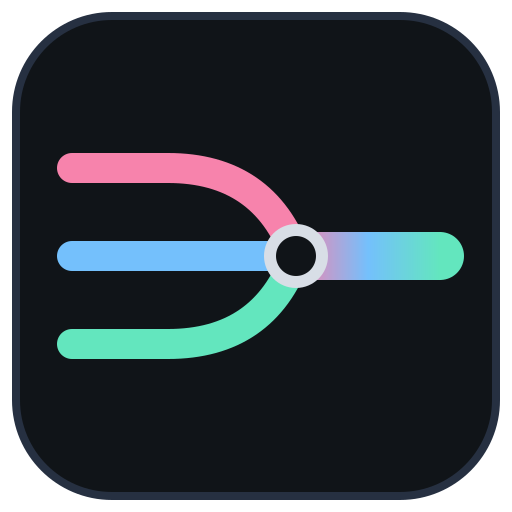
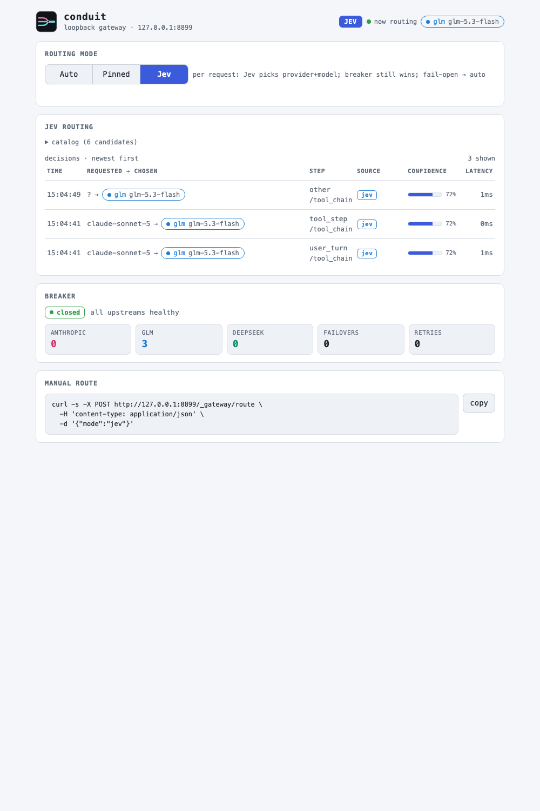
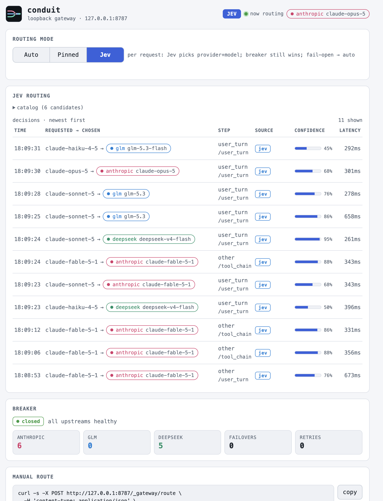
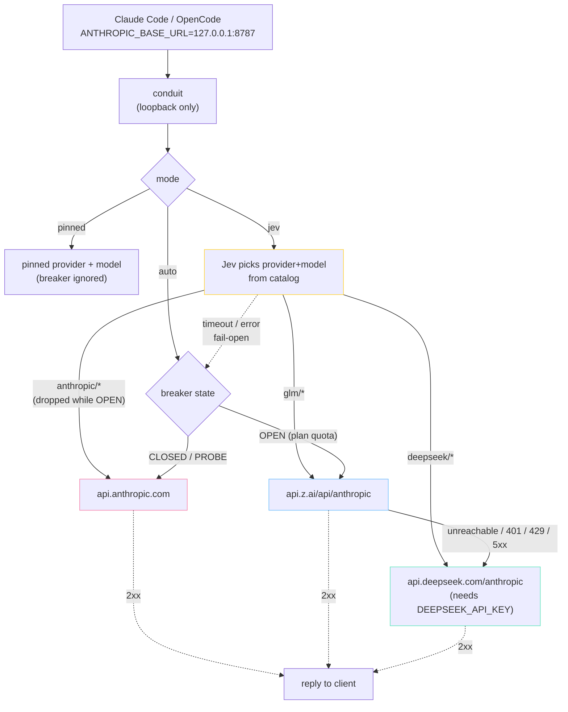
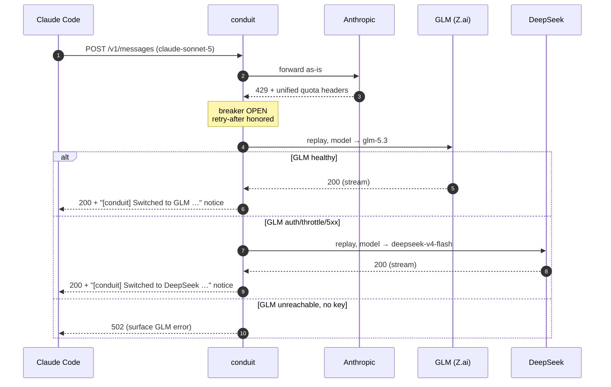

<p align="center"></p>

# conduit

Local loopback HTTP gateway for **Claude Code** and **OpenCode**, fronting
three upstreams:

1. **Anthropic** (Claude Code subscription OAuth) — default
2. **GLM via Z.ai** (`https://api.z.ai/api/anthropic`) — when plan quota is exhausted
3. **DeepSeek** (`https://api.deepseek.com/anthropic`) — optional terminal tier, when GLM itself fails

Both agents speak the Anthropic wire protocol, so either can ride the same
gateway: Claude Code via `ANTHROPIC_BASE_URL` with its OAuth credential, or
OpenCode via a local marker token that routes straight to GLM/DeepSeek.

While the subscription window has capacity, every request goes to Anthropic.
When a real plan-quota signal is observed, the gateway opens a circuit breaker
and transparently replays to GLM. When the open window expires it probes
Anthropic again and switches back automatically. If GLM is unreachable or
returns auth/throttle/5xx errors while the breaker is OPEN, the request is
retried once on DeepSeek — but only when `DEEPSEEK_API_KEY` is set; without
the key the tier is inert.


**Writeup:** [Conduit: keep coding when the Claude plan runs out](https://pedro-muller.com/ai/conduit/) on my blog.

## Control UI

Open `http://127.0.0.1:8787/_gateway/ui` to see live routing and pin a
provider/model manually:



Manual routing from inside Claude Code:

```bash
!curl -s -X POST localhost:8787/_gateway/route -d '{"provider":"glm","model":"glm-5.3-flash"}'
!curl -s -X POST localhost:8787/_gateway/route -d '{"clear":true}'   # back to automatic
```

Forced routing persists in `state.json` across restarts. Pinning `anthropic`
suppresses failover (quota errors surface raw); pinning `glm`/`deepseek` pins
every request to that provider with the model you choose.

## Control CLI

`./setup.sh` also installs `~/.local/bin/conduitctl` — a thin client for the
same endpoints, no `jq` and no config file needed:

```bash
conduitctl route                            # mode, pin, who served the last request
conduitctl route auto                       # back to automatic
conduitctl route jev                        # let Jev pick per call
conduitctl route pin glm glm-5.3            # → pinned
conduitctl status                           # mode, routing, breaker countdowns, counters
conduitctl status -json                     # the raw /_gateway/status payload
conduitctl decisions -n 5                   # tail ~/.local/state/conduit/decisions.jsonl
conduitctl ui                               # open the control page
```

It talks to `http://127.0.0.1:8787` (`CONDUIT_GATEWAY_URL` overrides) and says
`gateway not reachable at … is it running? (./status.sh)` instead of dumping a
Go error when nothing is listening. `./status.sh` uses it when installed and
falls back to `curl` + `jq` when it is not.

## Routing modes

| mode | behaviour |
|---|---|
| `auto` (default) | Anthropic; breaker OPEN → GLM → DeepSeek. Today's behaviour. |
| `pinned` | Every request to the provider/model you pinned (`forced_provider`/`forced_model`). Breaker ignored. |
| `jev` | Per call, ask **Jev** (TypeSafe System One) to pick the best-suited provider+model from the catalog — capability-first, across all three providers. Breaker still wins. Off unless `TYPESAFE_API_KEY` is set. |

Switch in the UI (mode selector) or from Claude Code:

```bash
!curl -s -X POST localhost:8787/_gateway/route -d '{"mode":"jev"}'
!curl -s -X POST localhost:8787/_gateway/route -d '{"mode":"auto"}'
!curl -s -X POST localhost:8787/_gateway/route -d '{"provider":"glm","model":"glm-5.3"}'   # → pinned
!curl -s -X POST localhost:8787/_gateway/route -d '{"clear":true}'                         # → auto
curl -s localhost:8787/_gateway/route | jq '.mode, .jev.recent[:3]'
```

Or with the CLI: `conduitctl route jev|auto`, `conduitctl route pin glm glm-5.3`.

`POST /_gateway/route` accepts `Content-Type: application/json` or
`application/x-www-form-urlencoded` (what plain `curl -d` sends) and refuses a
request carrying a foreign `Origin`, so a web page you happen to have open
cannot flip your routing. Other content types get 415, foreign origins 403.

`{"mode":"jev"}` returns 400 when no `TYPESAFE_API_KEY` is configured;
`{"mode":"pinned"}` returns 400 unless a provider was pinned before. The mode
persists in `state.json` across restarts.

**What Jev sees.** A bounded dossier built from the inbound `/v1/messages`
body, never the conversation: text of the last user message (clipped
~1200 chars head+tail), the step type (`user_turn` / `tool_step` / `other`),
tool names plus up to three short result excerpts (errors first), the tail of
the last assistant text on tool steps, the requested model, the thinking
budget, message count, whether images are present, tool count. The system
prompt and tool schemas are **not** sent. Your TypeSafe key never leaves the
machine except to `api.typesafe.ai`; Anthropic/Z.ai/DeepSeek keys are never
sent to Jev.

**Fail-open.** Jev timeout, error, or an answer outside the catalog → that one
call is routed exactly as `auto` would (`source: fail_open`). Jev never blocks
a request.

**Breaker precedence.** While the Anthropic breaker is OPEN (plan quota), the
`anthropic/*` catalog entries are removed from the candidates Jev sees, so it
can only choose GLM/DeepSeek. DeepSeek entries are removed when
`DEEPSEEK_API_KEY` is unset.

**Leases.** Jev also answers how long its pick should stick (`one_call`,
`tool_chain`, `user_turn`); follow-up tool steps in the same conversation
reuse the decision (`source: lease`) instead of asking again.

**Switch cost.** Switching models mid-conversation makes the new model
reprocess the whole context with a cold cache. Jev is told the thread's
current model and context size; on a large context a low-confidence switch
stays put (`source: sticky`), and a near-tie between Jev's top two picks stays
put too (`source: low_confidence`). Tune with `max_switch_context`,
`switch_confidence`, `min_margin` in `[jev]`.

**Sensitive turns stay first-party.** If the recent messages reference secret
material (`.env*`, `~/.ssh`, `*.pem`, `*.tfvars`, kubeconfig, cloud
credentials, …), GLM and DeepSeek are removed from the candidates before Jev
sees them (`policy: restricted`), and a Jev answer naming them falls open.
Configure with `restrict_sensitive`, `restricted_providers`,
`restricted_patterns`. This covers jev mode only — auto mode's breaker
failover still sends traffic to GLM/DeepSeek while Anthropic is OPEN.

**Half-open probes bypass Jev.** When an Anthropic entry's open window has
expired, that one call goes to Anthropic with the model you asked for (so the
breaker can decide whether to close) rather than to Jev's pick — the same probe
auto mode performs. Those calls carry no `X-Conduit-Decision`.

**Request size cap.** `/v1/messages` bodies are capped at 32 MiB; a larger body
is refused with 413 before anything is sent upstream. Only the *decision*
routing pays for parsing your body twice, so the cap applies in every mode.

Every decision (including fail-open) is appended to
`~/.local/state/conduit/decisions.jsonl` and exposed as `jev.recent` on
`GET /_gateway/route`; proxied responses carry `X-Conduit-Decision: jev|lease|sticky|low_confidence|fail_open`.

The log rotates at 4 MiB (one previous file, `decisions.jsonl.1`) and only ever
records clipped fields: the prompt excerpt, tool names and the requested model
are truncated before they reach the ring buffer, the API or the file, so a
one-off giant `model` string cannot blow up the UI's 2 s poll.

```json
{"at":"2026-09-22T10:14:03.512Z","requested_model":"claude-sonnet-5","provider":"glm","model":"glm-5.3-flash","step":"tool_step","lease":"tool_chain","source":"jev","confidence":0.81,"latency_ms":412}
```

**Honesty caveat.** Jev decides from short capability *priors* in the catalog
(`[[jev.catalog]]` profiles), not from measured output quality — it has never
seen the models' answers. The built-in policy is capability-first: it picks the
strongest model that will do the work, and steps down only for genuinely
mechanical steps. Each non-leased call adds roughly one
round-trip of latency (~200–800 ms typical, 4 s cap, then fail-open). If that
trade is wrong for you, stay in `auto`.

The idea and the System One question format come from
[jev-codex-router](https://github.com/0xNatoshi/jev-codex-router).

### Routing policy and catalog

Jev is asked one question per call: *which of these models is best suited to
the work that remains?* The instruction it gets is capability-first — use the
strongest model that will do the work well, step down only for a step that is
genuinely mechanical (a known-target edit, a title, a formatting pass, a routine
tool continuation), and never pick a weaker model because it is cheaper. The
ladder is stated per provider because Jev sees the candidates as an unordered
map:

| provider | ladder (strongest → lightest) |
|---|---|
| anthropic | `claude-fable-5-1` › `claude-opus-5-5` › `claude-opus-5` › `claude-sonnet-5` › `claude-haiku-4-5` |
| glm | `glm-5.3` › `glm-5.3-flash` |
| deepseek | `deepseek-v4-pro` › `deepseek-v4-flash` |

Those eight entries are the built-in catalog. Each carries a one-line
*profile* — the prior Jev reads when choosing — and that text is the tuning
lever. To change the policy, override the catalog in `config.toml`; defining
any entry replaces the whole default list:

```toml
[[jev.catalog]]
provider = "anthropic"
model = "claude-opus-5"
profile = "Frontier reasoning and coding. Ambiguous broad tasks, multi-file design, subtle correctness."

[[jev.catalog]]
provider = "glm"
model = "glm-5.3"
profile = "Capable coding model off the Claude plan: bounded implementation with clear requirements."
```

Only list ids that actually serve themselves. Retired provider ids can answer
`200` while a weaker model does the work — `deepseek-chat` and
`deepseek-reasoner` both return `deepseek-v4-flash` today — so a "reasoner"
entry would promise a tier the request never gets (issue #15).

Watch what it does before trusting it:

```bash
conduitctl decisions -n 20        # requested → chosen, step, lease, source, confidence, latency
conduitctl route                  # mode and who served the last request
```

The same feed in the control UI — one session, all three providers, with the
confidence Jev attached to each pick. This capture ran with a six-entry
`[[jev.catalog]]` override (no `sonnet`, no `haiku`), so requests for those ids
were re-homed by capability: `claude-sonnet-5` went to `glm-5.3` or
`deepseek-v4-flash` on lighter turns and *up* to `claude-fable-5-1` when the
work warranted it, while `claude-fable-5-1` and `claude-opus-5` stayed where
they were asked.



A healthy session shows `src=lease` on most tool continuations and `src=jev`
on new user turns; a stream of `src=fail_open` means Jev is unreachable and
you are getting plain `auto` routing.

For the full mechanics — the dossier, leases, fail-open, the breaker's
precedence — see [ARCHITECTURE.md](ARCHITECTURE.md#4-jev-routing-internalroute).

## Clients

**Claude Code** (default) — `./setup.sh` points it at the gateway
(`ANTHROPIC_BASE_URL=127.0.0.1:8787`). It keeps its normal OAuth credential and
rides the automatic breaker chain.

**OpenCode** (opt-in) — `CONDUIT_WIRE_OPENCODE=1 ./setup.sh` also adds an
`anthropic` provider entry to `~/.config/opencode/opencode.json` pointing at
the gateway with the local marker token (`conduit-local`). Token-less traffic
is routed straight to GLM (or `CONDUIT_LOCAL_PROVIDER`) since it has no
Anthropic credential to forward. Models appear in OpenCode as
`anthropic/claude-opus-5`, `claude-sonnet-5`, `claude-haiku-4-5`. `./uninstall.sh`
removes the entry again.

## Architecture

The request path in one picture; the full walkthrough — every branch of the
dispatcher, the error classifier, the breaker's states, what Jev sees, what
lives on disk, and how the repo is laid out — is in
[ARCHITECTURE.md](ARCHITECTURE.md).



Failover sequence for a single request:



## Quick start

You need [Go 1.26+](https://go.dev/dl/) and Claude Code.

```bash
./setup.sh
```

It builds the binary, asks for `ZAI_API_KEY` if missing, optionally asks for a
`TYPESAFE_API_KEY` (Jev routing mode — Enter to skip), points Claude Code at
the gateway, and keeps conduit running (starts at login on macOS, restarts if
it dies). Then **restart Claude Code**.

```bash
./status.sh        # health + breaker + routing mode
./stop.sh          # pause
./start.sh         # resume
./uninstall.sh     # stop service, remove conduitctl, un-point Claude Code
tail -f ~/.local/state/conduit/gateway.log
```

Already-open Claude sessions keep the old base URL until restarted.

Keep normal Claude OAuth. Do **not** put the Z.ai key in Claude's auth — the
gateway injects it only on the GLM path. Same for `DEEPSEEK_API_KEY` on the
DeepSeek path. Keys live in `~/.config/conduit/.env` (never in the repo).

Re-run `./setup.sh` after `git pull` to rebuild and reload.

## Verify it's working

```bash
./status.sh
# or: curl -s http://127.0.0.1:8787/_gateway/health
curl -s http://127.0.0.1:8787/_gateway/status | jq .last_request
```

After a Claude reply you should see `anthropic_requests` rise and log lines
with `"provider":"anthropic"`. On plan-quota failover: a `BREAKER OPEN` line,
then `"provider":"glm"`. Each request logs both the requested model and the
rewritten one:

```json
{"msg":"request","model":"claude-sonnet-5","upstream_model":"glm-5.3","provider":"glm","status":200}
```

### Failover notices

When routing changes, conduit tells you in three ways:

1. **Inside Claude Code (chat)** — the failover reply's first text is prefixed
   with `[conduit] Switched to GLM …` / `… to DeepSeek …`
2. **Inside Claude Code (status line)** — e.g. `conduit: GLM glm-5.3` (via
   your statusline polling `/_gateway/status`)
3. **Desktop notification** — macOS Notification Center (or `notify-send` on
   Linux); DeepSeek toasts are throttled to one per 5 minutes

Disable with `CONDUIT_NOTIFY=0`, or selectively with `CONDUIT_CHAT_NOTICE=0` /
`CONDUIT_DESKTOP_NOTIFY=0`.

## Critical constraint

The Anthropic API does not expose a per-request "this will be billed to API
credits" flag. Billing mode is a property of the credential. This gateway only
reacts to observable HTTP signals (status, `error.type`, rate-limit headers).

Not every `429` is quota. Claude Code distinguishes plan limits
(`anthropic-ratelimit-unified-*` headers) from transient "Server is temporarily
limiting requests (not your usage limit)" throttles. Only the former opens the
breaker. Details: [`FINDINGS.md`](./FINDINGS.md).

## Environment

| Variable | Required | Purpose |
|---|---|---|
| `ZAI_API_KEY` | **yes** (gateway) | Z.ai API key used when routing to GLM. Stored in `~/.config/conduit/.env` |
| `DEEPSEEK_API_KEY` | no | Enables the terminal DeepSeek tier when set. Stored in `~/.config/conduit/.env` |
| `TYPESAFE_API_KEY` | no | Enables Jev routing mode when set (`./setup.sh` asks once; Enter to skip). Stored in `~/.config/conduit/.env` |
| `CONDUIT_JEV_TIMEOUT_MS` | no | Jev round-trip cap before fail-open (default `4000`) |
| `CONDUIT_SKIP_JEV_PROMPT` | no | Set to `1` to make `./setup.sh` skip the TypeSafe key prompt |
| `ANTHROPIC_BASE_URL` | for Claude Code | Set to `http://127.0.0.1:8787` by `./setup.sh` |
| `CLAUDE_GLM_GATEWAY_CONFIG` | no | Alternate config path |
| `CLAUDE_GLM_GATEWAY_LISTEN` | no | Override `listen` |
| `CLAUDE_GLM_GATEWAY_STATE_PATH` | no | Breaker state file |
| `CLAUDE_GLM_GATEWAY_CAPTURE_PATH` | no | Upstream error JSONL |
| `CONDUIT_NOTIFY` | no | Set to `0` to disable all failover notices |
| `CONDUIT_CHAT_NOTICE` | no | Set to `0` to disable in-chat notice |
| `CONDUIT_DESKTOP_NOTIFY` | no | Set to `0` to disable desktop toast |
| `CONDUIT_OTHER_GATEWAY_LABEL` | no | launchd label of another gateway to stop during setup |
| `CONDUIT_LOCAL_TOKEN` | no | Marker credential for token-less clients (default `conduit-local`). Used by the OpenCode wiring |
| `CONDUIT_LOCAL_PROVIDER` | no | Provider for local-token traffic: `glm` (default), `deepseek`, or `anthropic` |
| `CONDUIT_GATEWAY_URL` | no | Gateway URL used by `conduitctl` (default `http://127.0.0.1:8787`) |
| `CONDUIT_DECISIONS_PATH` | no | Decision log path for `conduitctl decisions` (default under `~/.local/state/conduit`) |
| `CONDUIT_WIRE_OPENCODE` | no | Set to `1` to have `./setup.sh` wire OpenCode to the gateway |

## Model mapping

On the DeepSeek tier only, a tool named `Artifact` is dropped from the request
before forwarding (its `input_schema` is rejected by DeepSeek's
Anthropic-compatible validator, which would fail the tier outright while
Anthropic and GLM accept it). If that was the only declared tool, the request
goes out without a `tools` key at all. This applies in every routing mode and
is the one place conduit does not forward your tool list untouched.

Claude Code sends Anthropic model IDs. On the GLM/DeepSeek paths the gateway
rewrites only the JSON `model` field using `[glm.model_map]` /
`[deepseek.model_map]` / `default_model` (see `config.example.toml`).

| Claude Code sends | GLM receives | DeepSeek receives |
|---|---|---|
| opus / sonnet | `glm-5.3` | `deepseek-v4-flash` |
| haiku | `glm-5.3-flash` | `deepseek-v4-flash` |
| anything else | `glm-5.3` | `deepseek-v4-flash` |

A pinned model (via UI or `/_gateway/route`) overrides all of the above, and so
does a Jev pick in `jev` mode — including on the Anthropic path when Jev chooses
a different Claude model than the one requested.

## Tests

```bash
make test
```

## Non-goals

No cost dashboards, no mid-stream provider splicing, no response caching, no
non-loopback bind, no gateway auth beyond localhost, no LLM-based routing
without explicit opt-in (`jev` mode is off by default and needs a key you
provide).
