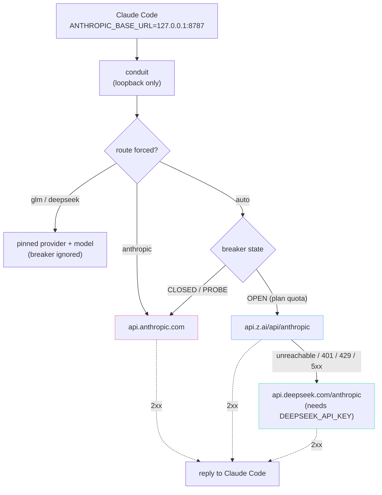
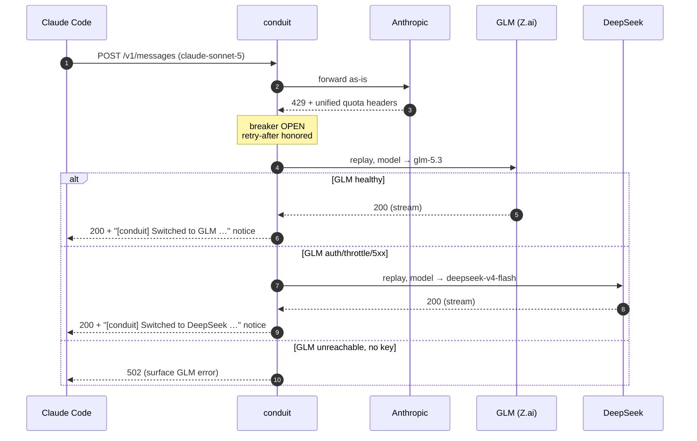

# conduit

Local loopback HTTP gateway between **Claude Code** and three upstreams:

1. **Anthropic** (Claude Code subscription OAuth) — default
2. **GLM via Z.ai** (`https://api.z.ai/api/anthropic`) — when plan quota is exhausted
3. **DeepSeek** (`https://api.deepseek.com/anthropic`) — optional terminal tier, when GLM itself fails

While the subscription window has capacity, every request goes to Anthropic.
When a real plan-quota signal is observed, the gateway opens a circuit breaker
and transparently replays to GLM. When the open window expires it probes
Anthropic again and switches back automatically. If GLM is unreachable or
returns auth/throttle/5xx errors while the breaker is OPEN, the request is
retried once on DeepSeek — but only when `DEEPSEEK_API_KEY` is set; without
the key the tier is inert.

## Control UI

Open `http://127.0.0.1:8787/_gateway/ui` to see live routing and pin a
provider/model manually:


Manual routing from inside Claude Code:

```bash
!curl -s -X POST localhost:8787/_gateway/route -d '{"provider":"glm","model":"glm-5.3-flash"}'
!curl -s -X POST localhost:8787/_gateway/route -d '{"clear":true}'   # back to automatic
```

Forced routing persists in `state.json` across restarts. Pinning `anthropic`
suppresses failover (quota errors surface raw); pinning `glm`/`deepseek` pins
every request to that provider with the model you choose.

## Architecture



Failover sequence for a single request:



## Quick start

You need [Go 1.26+](https://go.dev/dl/) and Claude Code.

```bash
./setup.sh
```

It builds the binary, asks for `ZAI_API_KEY` if missing, points Claude Code at
the gateway, and keeps conduit running (starts at login on macOS, restarts if
it dies). Then **restart Claude Code**.

```bash
./status.sh        # health + breaker
./stop.sh          # pause
./start.sh         # resume
./uninstall.sh     # stop service and un-point Claude Code
tail -f ~/.local/state/conduit/gateway.log
```

Already-open Claude sessions keep the old base URL until restarted.

Keep normal Claude OAuth. Do **not** put the Z.ai key in Claude's auth — the
gateway injects it only on the GLM path. Same for `DEEPSEEK_API_KEY` on the
DeepSeek path. Keys live in `~/.config/conduit/.env` (never in the repo).

Re-run `./setup.sh` after `git pull` to rebuild and reload.

## Verify it's working

```bash
./status.sh
# or: curl -s http://127.0.0.1:8787/_gateway/health
curl -s http://127.0.0.1:8787/_gateway/status | jq .last_request
```

After a Claude reply you should see `anthropic_requests` rise and log lines
with `"provider":"anthropic"`. On plan-quota failover: a `BREAKER OPEN` line,
then `"provider":"glm"`. Each request logs both the requested model and the
rewritten one:

```json
{"msg":"request","model":"claude-sonnet-5","upstream_model":"glm-5.3","provider":"glm","status":200}
```

### Failover notices

When routing changes, conduit tells you in three ways:

1. **Inside Claude Code (chat)** — the failover reply's first text is prefixed
   with `[conduit] Switched to GLM …` / `… to DeepSeek …`
2. **Inside Claude Code (status line)** — e.g. `conduit: GLM glm-5.3` (via
   your statusline polling `/_gateway/status`)
3. **Desktop notification** — macOS Notification Center (or `notify-send` on
   Linux); DeepSeek toasts are throttled to one per 5 minutes

Disable with `CONDUIT_NOTIFY=0`, or selectively with `CONDUIT_CHAT_NOTICE=0` /
`CONDUIT_DESKTOP_NOTIFY=0`.

## Critical constraint

The Anthropic API does not expose a per-request "this will be billed to API
credits" flag. Billing mode is a property of the credential. This gateway only
reacts to observable HTTP signals (status, `error.type`, rate-limit headers).

Not every `429` is quota. Claude Code distinguishes plan limits
(`anthropic-ratelimit-unified-*` headers) from transient "Server is temporarily
limiting requests (not your usage limit)" throttles. Only the former opens the
breaker. Details: [`FINDINGS.md`](./FINDINGS.md).

## Environment

| Variable | Required | Purpose |
|---|---|---|
| `ZAI_API_KEY` | **yes** (gateway) | Z.ai API key used when routing to GLM. Stored in `~/.config/conduit/.env` |
| `DEEPSEEK_API_KEY` | no | Enables the terminal DeepSeek tier when set. Stored in `~/.config/conduit/.env` |
| `ANTHROPIC_BASE_URL` | for Claude Code | Set to `http://127.0.0.1:8787` by `./setup.sh` |
| `CLAUDE_GLM_GATEWAY_CONFIG` | no | Alternate config path |
| `CLAUDE_GLM_GATEWAY_LISTEN` | no | Override `listen` |
| `CLAUDE_GLM_GATEWAY_STATE_PATH` | no | Breaker state file |
| `CLAUDE_GLM_GATEWAY_CAPTURE_PATH` | no | Upstream error JSONL |
| `CONDUIT_NOTIFY` | no | Set to `0` to disable all failover notices |
| `CONDUIT_CHAT_NOTICE` | no | Set to `0` to disable in-chat notice |
| `CONDUIT_DESKTOP_NOTIFY` | no | Set to `0` to disable desktop toast |
| `CONDUIT_OTHER_GATEWAY_LABEL` | no | launchd label of another gateway to stop during setup |

## Model mapping

Claude Code sends Anthropic model IDs. On the GLM/DeepSeek paths the gateway
rewrites only the JSON `model` field using `[glm.model_map]` /
`[deepseek.model_map]` / `default_model` (see `config.example.toml`).

| Claude Code sends | GLM receives | DeepSeek receives |
|---|---|---|
| opus / sonnet | `glm-5.3` | `deepseek-v4-flash` |
| haiku | `glm-5.3-flash` | `deepseek-v4-flash` |
| anything else | `glm-5.3` | `deepseek-v4-flash` |

A pinned model (via UI or `/_gateway/route`) overrides all of the above.

## Tests

```bash
make test
```

## Non-goals

No cost dashboards, no mid-stream provider splicing, no response caching, no
non-loopback bind, no gateway auth beyond localhost.
